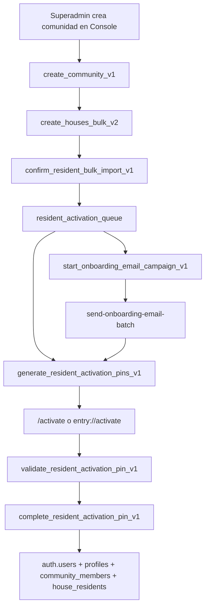

# ENTRY Community Registration - Phase 0 Reconciliation

**Fecha de corte:** 2026-08-05
**Tipo:** analisis tecnico y arquitectonico formal, read-only.
**Alcance:** Minerva Console, ENTRY mobile y Supabase vivo `gate-project-dev` (`ytzvislhvrcdtkbtpbmu`).
**Restricciones cumplidas:** no se implemento codigo, no se modifico Supabase, no se ejecuto migracion, no se cambio RLS, grants, Auth, Edge Functions, ramas, commits, PRs ni deployments.

## 1. Veredicto ejecutivo

**GO WITH PREREQUISITES.**

La implementacion de un flujo de registro comunitario / pre-onboarding es tecnicamente viable y arquitectonicamente recomendable, pero no debe construirse directamente encima de `profiles`, `community_members`, `house_residents`, `resident_invites` ni `resident_activation_queue` como primer punto de captura publica. Debe introducirse una capa nueva de pre-onboarding con revision interna y conversion explicita hacia `resident_activation_queue`.

| Claim | Estado | Evidencia |
| --- | --- | --- |
| Minerva Console ya tiene onboarding interno, importacion, cola de activacion, PINs, campanas y activacion final. | CONFIRMED | `features/entry/communities/actions.ts:219`, `:264`, `:325`, `:384`; `features/entry/activation/actions.ts:298`; `features/entry/activation/pinActions.ts:51`; `features/entry/activation/createUserActions.ts:138`; `supabase/functions/send-onboarding-email-batch/index.ts:1-30`. |
| ENTRY mobile ya consume la activacion por PIN de la cola nueva. | CONFIRMED | `D:\Dev\node-bridge-foundation\app\activate-account.tsx:470`, `:633`. |
| Supabase vivo contiene las tablas y RPCs nucleares usadas por Console. | CONFIRMED | Catalogo vivo: `communities`, `houses`, `profiles`, `community_members`, `house_residents`, `resident_activation_queue`, `resident_activation_pins`, `onboarding_campaigns`, `onboarding_campaign_messages`; RPCs `create_community_v1`, `create_houses_bulk_v2`, `confirm_resident_bulk_import_v1`, `list_resident_activation_queue_v1`, `generate_resident_activation_pins_v1`, `validate_resident_activation_pin_v1`, `complete_resident_activation_pin_v1`. |
| No existe modulo actual de registro comunitario/pre-onboarding. | CONFIRMED | Busqueda local en Console y ENTRY mobile no encontro `community_registration`, `pre_onboarding`, `registration_campaign`, `onboarding_submission`; catalogo vivo tampoco encontro tablas con esos prefijos. |
| Conviene separar pre-onboarding de activacion final. | RECOMMENDED | El flujo actual crea usuarios solo al completar PIN; `resident_activation_queue` ya es una cola operativa revisada, no una zona publica de captura sin validar. |

## 2. Top 5 hallazgos

1. **CONFIRMED:** el proyecto vivo `gate-project-dev` esta activo y contiene el modelo operativo de ENTRY: comunidades, viviendas, perfiles, membresias, residentes por vivienda, cola de activacion, PINs y campanas.
2. **CONFIRMED:** Minerva Console es el repositorio mas reciente para esta linea (`codex/entry-first-door-patronato-package-v1`, `94d895d`, 2026-08-03); ENTRY mobile esta en `entry-reset-003-recovery-deeplink-evidence` / `main`, `79706be`, 2026-07-28.
3. **CONFIRMED:** hay dos carriles historicos vivos: el nuevo `resident_activation_queue` + PINs, y el legacy/mobile `resident_invites` + `account_activation_codes` + Edge Functions. El registro comunitario no debe aumentar esa ambiguedad.
4. **CONFIRMED:** las migraciones locales actuales no son un espejo trazable por version del historial vivo. Supabase tiene 292 migraciones aplicadas con versiones reales entre `20260403085124` y `20260518061102`; los archivos locales usan otros timestamps para varias piezas equivalentes.
5. **RECOMMENDED:** crear tablas nuevas `community_registration_*` y convertir a `resident_activation_queue` solo despues de revision, deduplicacion y aprobacion del patronato/operador.

## 3. Fuentes revisadas

| Fuente | Estado | Evidencia |
| --- | --- | --- |
| Reporte inicial `content/brain/harness/ENTRY_COMMUNITY_ONBOARDING_ANALYSIS.md`. | CONFIRMED | Leido completamente antes de esta reconciliacion; define la recomendacion base de pre-onboarding separado. |
| Minerva Console `D:\Dev\minerva-console`. | CONFIRMED | Rama `codex/entry-first-door-patronato-package-v1`; HEAD `94d895d`; repo remoto `rodchakk/minerva-console`. |
| ENTRY mobile `D:\Dev\node-bridge-foundation`. | CONFIRMED | Rama `entry-reset-003-recovery-deeplink-evidence`; HEAD `79706be`; Expo app `Entry`, slug `gatewise`, scheme `entry`. |
| Supabase vivo `gate-project-dev`. | CONFIRMED | Project ref `ytzvislhvrcdtkbtpbmu`, region `us-east-1`, status `ACTIVE_HEALTHY`, Postgres `17.6.1.063`. |
| Brain rules. | CONFIRMED | `content/brain/harness/05_AGENT_RULES.md` prohibe raw ENTRY operational data in Brain; este documento guarda solo metadatos y analisis. |

## 4. Auditoria de no escritura

| Area | Estado |
| --- | --- |
| Product code | CONFIRMED: no se modifico. |
| Supabase DB | CONFIRMED: solo consultas de catalogo `SELECT`; no DDL/DML/migraciones. |
| Supabase Edge Functions | CONFIRMED: solo listado de funciones; no deploy. |
| Auth/config/RLS/grants | CONFIRMED: no se cambio nada. |
| Git | CONFIRMED: no branch switch, no commit, no PR, no push. |
| Brain | CONFIRMED: se agrego este reporte Markdown como artefacto documental. |

## 5. Estado del repositorio mas reciente

**CONFIRMED:** Minerva Console es la fuente mas reciente de trabajo sobre onboarding/paquete patronato.

| Repo | Rama local | HEAD | Fecha | Nota |
| --- | --- | --- | --- | --- |
| `D:\Dev\minerva-console` | `codex/entry-first-door-patronato-package-v1` | `94d895d` | 2026-08-03 23:41:57 -0600 | Mas reciente y alineado con FIRST DOOR / roadmap review. |
| `D:\Dev\node-bridge-foundation` | `entry-reset-003-recovery-deeplink-evidence` | `79706be` | 2026-07-28 20:38:14 -0600 | Mobile ENTRY; rama igual a `main`, con cambios locales en password reset/AuthProvider. |

**OPEN:** no se hizo `git fetch`; la comparacion es contra refs locales/remotas ya presentes en disco.

## 6. Baseline del reporte previo

**CONFIRMED:** el reporte inicial concluye que no existe una puerta publica de registro comunitario y que la cola de activacion actual presupone residentes ya preparados. Tambien recomienda crear una capa de pre-onboarding separada y convertir hacia `resident_activation_queue`.

**RECOMMENDED:** mantener ese diagnostico como baseline, pero actualizarlo con esta reconciliacion viva: las tablas/RPCs base que el reporte previo marcaba como ausentes en migraciones locales si existen en Supabase vivo.

## 7. Arquitectura actual en Minerva Console

| Componente | Estado | Evidencia |
| --- | --- | --- |
| Gate superadmin para consola. | CONFIRMED | `app/(console)/layout.tsx` llama `requireSuperadmin`; `features/auth/requireSuperadmin.ts` usa RPC `is_superadmin`. |
| Rutas publicas actuales. | CONFIRMED | `lib/supabase/middleware.ts:42-43` permite `/activate` y `/reset-password`; no aparece ruta publica de registro comunitario. |
| Creacion de comunidad. | CONFIRMED | `features/entry/communities/actions.ts:264` llama `create_community_v1`. |
| Creacion/importacion de viviendas. | CONFIRMED | `features/entry/communities/actions.ts:219`, `:325` llaman `create_houses_bulk_v2`. |
| Importacion avanzada a cola. | CONFIRMED | `features/entry/communities/actions.ts:384` llama `confirm_resident_bulk_import_v1`. |
| Cola de activacion. | CONFIRMED | `features/entry/activation/actions.ts:298` llama `list_resident_activation_queue_v1`. |
| PINs y activacion final. | CONFIRMED | `features/entry/activation/pinActions.ts:51`; `features/entry/activation/createUserActions.ts:138`; `app/activate/page.tsx:115`, `:203`. |
| Campanas actuales. | CONFIRMED | `features/entry/onboardingCampaigns/actions.ts:38`, `:140`; `supabase/functions/send-onboarding-email-batch/index.ts:1-30`. |

## 8. Arquitectura actual en ENTRY mobile

| Componente | Estado | Evidencia |
| --- | --- | --- |
| App mobile real. | CONFIRMED | `D:\Dev\node-bridge-foundation\app.json`: name `Entry`, slug `gatewise`, scheme `entry`, bundle/package `com.minervatechnologies.entry`. |
| Activacion por PIN nuevo. | CONFIRMED | `app/activate-account.tsx:470` valida `validate_resident_activation_pin_v1`; `:633` completa `complete_resident_activation_pin_v1`. |
| Fallback Edge Function legacy. | CONFIRMED | `app/activate-account.tsx:670-671` invoca `activate-account-by-code`. |
| Carril legacy de invitaciones. | CONFIRMED | `supabase/functions/activate-account-by-code/index.ts:5`, `:106`, `:269`; `supabase/functions/claim-resident-invite/index.ts:127`. |
| Recuperacion y codigos de usuario. | CONFIRMED | `admin-generate-recovery-code`, `regenerate-username-activation-code`, `validate-activation-code` existen localmente y vivos. |

## 9. Supabase vivo: proyecto y salud

| Campo | Valor |
| --- | --- |
| Proyecto | `gate-project-dev` |
| Ref | `ytzvislhvrcdtkbtpbmu` |
| Estado | `ACTIVE_HEALTHY` |
| Region | `us-east-1` |
| Postgres | `17.6.1.063`, engine `17`, release `ga` |

**CONFIRMED:** `seshat` tambien aparece en la cuenta, pero esta `INACTIVE`; no debe usarse para esta implementacion.

## 10. Supabase vivo: tablas reconciliadas

| Tabla | Estado vivo | RLS | Clasificacion |
| --- | --- | --- | --- |
| `communities` | Existe | enabled | LIVE_CONFIRMED |
| `houses` | Existe | enabled | LIVE_CONFIRMED |
| `profiles` | Existe | enabled | LIVE_CONFIRMED |
| `community_members` | Existe | enabled | LIVE_CONFIRMED |
| `house_residents` | Existe | enabled | LIVE_CONFIRMED |
| `community_settings` | Existe | enabled | LIVE_CONFIRMED |
| `resident_activation_queue` | Existe, 21 columnas | enabled | LIVE_CONFIRMED |
| `resident_activation_pins` | Existe, 10 columnas | enabled | LOCAL_CONSOLE_AND_LIVE |
| `onboarding_campaigns` | Existe, 19 columnas | enabled | LOCAL_CONSOLE_AND_LIVE |
| `onboarding_campaign_messages` | Existe, 20 columnas | enabled | LOCAL_CONSOLE_AND_LIVE |
| `resident_invites` | Existe, 16 columnas | enabled | LEGACY_LIVE_AND_MOBILE |
| `account_activation_codes` | Existe, 12 columnas | enabled | LEGACY_LIVE_AND_MOBILE |
| `security_event_log` | Existe | enabled | LIVE_CONFIRMED |
| `superadmin_audit_log` | Existe | enabled | LIVE_CONFIRMED |

**CONFIRMED:** no existen tablas vivas `community_registration`, `pre_onboarding`, `registration_campaign`, `onboarding_submission` ni equivalentes encontradas por busqueda de catalogo.

## 11. Supabase vivo: RPCs nucleares

| RPC | Firma viva | Security definer | Clasificacion |
| --- | --- | --- | --- |
| `create_community_v1` | `(p_name text, p_city text, p_unit_label text, p_allow_frequent_access boolean, p_allow_reservations boolean, p_allow_messages boolean) -> uuid` | true | LIVE_ONLY_FOR_LOCAL_CURRENT |
| `create_houses_bulk_v2` | `(p_community_id uuid, p_houses text[]) -> jsonb` | true | LIVE_ONLY_FOR_LOCAL_CURRENT |
| `confirm_resident_bulk_import_v1` | `(p_community_id uuid, p_rows jsonb, p_create_missing_units boolean) -> jsonb` | true | LIVE_CONFIRMED |
| `list_resident_activation_queue_v1` | `(p_community_id uuid, p_status text) -> table` | true | LIVE_ONLY_FOR_LOCAL_CURRENT |
| `generate_resident_activation_pins_v1` | `(p_community_id uuid, p_queue_ids uuid[]) -> jsonb` | true | LOCAL_CONSOLE_AND_LIVE |
| `validate_resident_activation_pin_v1` | `(p_pin text) -> jsonb` | true | LOCAL_CONSOLE_AND_LIVE |
| `complete_resident_activation_pin_v1` | `(p_pin text, p_password text, p_username text) -> jsonb` | true | LOCAL_CONSOLE_AND_LIVE |
| `start_onboarding_email_campaign_v1` | `(p_community_id uuid, p_send_rate_per_minute integer, p_include_already_invited boolean, p_name text, p_dry_run boolean) -> jsonb` | true | LOCAL_CONSOLE_AND_LIVE |
| `worker_generate_resident_activation_pin_v1` | `(p_community_id uuid, p_queue_id uuid) -> jsonb` | true | LOCAL_CONSOLE_AND_LIVE |

**CONFIRMED:** `complete_resident_activation_pin_v1` vivo referencia `auth.users`, `profiles`, `community_members`, `house_residents`, `resident_activation_queue` y `resident_activation_pins`; por tanto es el punto de creacion final de usuario.

**CONFIRMED:** `confirm_resident_bulk_import_v1` vivo referencia `resident_activation_queue` pero no `auth.users`, `profiles`, `community_members` ni `house_residents`; por tanto es preparacion, no activacion final.

## 12. Supabase vivo: Edge Functions

| Slug | Estado | JWT | Version viva | Clasificacion |
| --- | --- | --- | --- | --- |
| `send-onboarding-email-batch` | ACTIVE | true | 2 | LOCAL_CONSOLE_AND_LIVE |
| `claim-resident-invite` | ACTIVE | false | 22 | LEGACY_LIVE_AND_MOBILE |
| `activate-account-by-code` | ACTIVE | false | 21 | LEGACY_LIVE_AND_MOBILE |
| `validate-activation-code` | ACTIVE | false | 4 | LEGACY_LIVE_AND_MOBILE |
| `create-username-resident` | ACTIVE | false | 15 | LEGACY_LIVE_AND_MOBILE |
| `login-with-username` | ACTIVE | false | 15 | MOBILE_AUTH_LIVE |
| `request-email-link` | ACTIVE | true | 19 | MOBILE_AUTH_LIVE |
| `confirm-email-link` | ACTIVE | true | 12 | MOBILE_AUTH_LIVE |
| `admin-generate-recovery-code` | ACTIVE | false | 2 | MOBILE_ADMIN_LIVE |
| `regenerate-username-activation-code` | ACTIVE | false | 8 | MOBILE_ADMIN_LIVE |
| Otros (`send-push-event`, `sa-create-user`, etc.) | ACTIVE | mixed | mixed | OUT_OF_SCOPE_SUPPORTING |

**OPEN:** no se hizo comparacion byte-for-byte de fuentes Edge desplegadas vs locales; el listado vivo confirma slug, estado, `verify_jwt`, version y hash de despliegue.

## 13. Reconciliacion de migraciones

**CONFIRMED:** el historial vivo tiene 292 migraciones aplicadas. La primera version listada es `20260403085124`; la ultima es `20260518061102`.

**CONFIRMED:** las versiones locales actuales no coinciden con los numeros aplicados vivos para varias piezas equivalentes. Ejemplo: Console local tiene `20260502140000_generate_resident_activation_pins_v1.sql`, mientras Supabase vivo registra el nombre logico `generate_resident_activation_pins_v1` con version `20260502233847`.

| Pieza | Local Console | Local ENTRY mobile | Vivo | Lectura |
| --- | --- | --- | --- | --- |
| `resident_activation_pins` + `generate_resident_activation_pins_v1` | Si | No | Si | Reconciliada por nombre/firma, no por version. |
| `validate_resident_activation_pin_v1` | Si | Consumida por app | Si | Reconciliada por nombre/firma. |
| `complete_resident_activation_pin_v1` | Si, con fix posterior | Consumida por app | Si | Reconciliada por nombre/firma y semantica. |
| `onboarding_campaigns` | Si | No | Si | Reconciliada por nombre/firma. |
| `send-onboarding-email-batch` | Si | No | Si | Reconciliada por slug vivo. |
| `resident_invites` | No como migracion actual | Si, via funciones/UI | Si | Legacy vivo/mobile. |
| `account_activation_codes` | No como migracion actual | Si, via funciones/UI | Si | Legacy vivo/mobile. |
| `community_registration_*` | No | No | No | Nuevo modulo requerido. |

**RECOMMENDED:** antes de implementar, crear una mision de hygiene para documentar el estado canonico de migraciones vivas o generar un baseline SQL versionado. No bloquearia el diseno, pero si reduce riesgo de drift.

## 14. Flujo real actual

**CONFIRMED:** el flujo actual empieza en una operacion interna de superadmin/importacion y termina en usuario real solo al completar PIN.

**INFERRED:** `resident_activation_queue` es el mejor destino de conversion desde pre-onboarding aprobado, porque ya esta conectado a PINs, email campaign, activation page y ENTRY mobile.

## 15. Problema de producto a resolver

**CONFIRMED:** no hay ruta publica privada para que un patronato distribuya un link y los residentes registren/corrijan informacion por vivienda antes de crear usuarios.

**INFERRED:** el problema no es "activar mas rapido", sino "capturar informacion comunitaria incompleta o incierta sin contaminar usuarios operativos".

**RECOMMENDED:** el flujo nuevo debe llamarse "Community Registration" o "Pre-Onboarding", no "Activation", para proteger las fronteras mentales y tecnicas.

## 16. Modelo recomendado

Tablas nuevas sugeridas:

| Tabla | Proposito | Estado |
| --- | --- | --- |
| `community_registration_campaigns` | Campana por comunidad, slug/token, estado, expiracion, reglas de captura. | RECOMMENDED |
| `community_registration_units` | Viviendas ofrecidas/confirmadas durante registro, con estado de revision. | RECOMMENDED |
| `community_registration_submissions` | Envio por vivienda/contacto, versionado y estado. | RECOMMENDED |
| `community_registration_residents` | Personas declaradas por submission antes de activar. | RECOMMENDED |
| `community_registration_events` | Auditoria: creada, editada, enviada, revisada, aprobada, convertida. | RECOMMENDED |
| `community_registration_tokens` | Si se requiere link no adivinable por vivienda/campana. | RECOMMENDED, sujeto a diseno de seguridad. |

**RECOMMENDED:** no insertar directamente en `profiles`, `community_members`, `house_residents` ni `auth.users` desde formularios publicos.

**RECOMMENDED:** convertir filas aprobadas a `resident_activation_queue` mediante RPC versionada `approve_community_registration_submission_v1` o equivalente, con auditoria superadmin.

## 17. Fronteras de aplicacion

| Superficie | Recomendacion | Estado |
| --- | --- | --- |
| Ruta publica | `app/register/[campaignSlug]` o `app/(public)/entry/register/[campaignSlug]` si el layout lo permite. | RECOMMENDED |
| Admin Console | Panel interno bajo comunidad para crear campana, revisar submissions, aprobar y convertir. | RECOMMENDED |
| Supabase | RPCs SECURITY DEFINER para operaciones de revision/conversion; tablas con RLS estricta. | RECOMMENDED |
| ENTRY mobile | Sin dependencia inicial; mobile solo consume activacion existente cuando el registro aprobado llegue a PIN. | RECOMMENDED |

**OPEN:** el nombre exacto de ruta debe validarse contra las convenciones actuales de Next.js en este repo antes de implementar.

## 18. Seguridad, RLS y abuso

**CONFIRMED:** todas las tablas relevantes inspeccionadas tienen RLS enabled.

**CONFIRMED:** varias tablas tienen grants amplios a `anon` o `authenticated` a nivel SQL, pero RLS/policies limitan acceso. Esto no confirma fuga por si solo, pero exige cuidado al agregar tablas publicas nuevas.

**RECOMMENDED:** para `community_registration_*`:

- RLS default deny.
- Solo RPCs publicas estrechas para leer campana activa por token/slug y crear/actualizar submission permitida.
- No exposicion de listas completas de viviendas si el patronato no lo autoriza.
- Rate limits por token/IP/fingerprint cuando aplique.
- Guardar eventos sin datos sensibles innecesarios.
- No almacenar secretos en Brain ni en client bundles.

## 19. Datos y privacidad

**RECOMMENDED:** el formulario debe pedir lo minimo para validar una vivienda y preparar activacion:

- vivienda/unidad declarada;
- nombre de responsable;
- telefono y/o email;
- residentes adicionales opcionales;
- confirmacion de autorizacion/comunicacion;
- notas para revision interna.

**RECOMMENDED:** separar "datos declarados" de "datos aprobados". La conversion a `resident_activation_queue` debe ser una accion explicita y auditable.

## 20. Riesgos y blockers

| Riesgo / blocker | Severidad | Estado | Mitigacion |
| --- | --- | --- | --- |
| No existe esquema `community_registration_*`. | Alta | CONFIRMED | Crear migraciones nuevas antes de UI. |
| Drift de migraciones locales vs vivo. | Alta | CONFIRMED | Crear baseline/reconciliation script o registrar mapa de migraciones aplicadas. |
| Doble carril legacy (`resident_invites`) y nuevo (`resident_activation_queue`). | Media | CONFIRMED | Declarar `resident_activation_queue` como destino canonical para este modulo. |
| Rutas publicas actuales limitadas a activate/reset-password. | Media | CONFIRMED | Ajustar middleware en implementacion futura con tests. |
| Politicas y grants amplios en tablas existentes. | Media | CONFIRMED | Disenar RLS default-deny y probar roles anon/authenticated/service_role. |
| Reglas Brain prohiben datos operativos raw. | Media | CONFIRMED | Mantener solo metadatos/documentacion en Brain. |

## 21. Plan recomendado de implementacion

1. **Database design mission:** crear migraciones `community_registration_*`, RLS default-deny, policies, constraints, indexes y RPCs versionadas.
2. **Console admin mission:** crear gestion de campanas y review queue en Minerva Console.
3. **Public route mission:** crear formulario publico por token/slug con estados de submission.
4. **Conversion mission:** aprobar submission y convertir a `resident_activation_queue` sin crear Auth user.
5. **Activation mission:** reutilizar flujo actual de PIN/campana/ENTRY mobile.
6. **QA/security mission:** probar anon/authenticated/service_role, rate limits, expiracion, dedupe y auditoria.

**RECOMMENDED:** implementar en Minerva Console primero. ENTRY mobile no necesita cambios para Phase 1 si el resultado final sigue entrando por PIN/link actual.

## 22. Decision final

**GO WITH PREREQUISITES** porque:

- la base operativa viva de ENTRY existe y esta sana;
- Console ya contiene los flujos internos necesarios despues de la aprobacion;
- ENTRY mobile ya consume la activacion final;
- no existe todavia la capa publica de pre-onboarding;
- la implementacion requiere nuevas tablas/RPCs/RLS y una decision canonica sobre el carril `resident_activation_queue`;
- hay deuda de trazabilidad de migraciones que debe documentarse antes o durante la primera mision de DB.

Prerequisitos minimos antes de codear:

1. Aceptar `resident_activation_queue` como destino canonical post-aprobacion.
2. Aprobar el modelo `community_registration_*`.
3. Definir visibilidad publica de viviendas: lista completa, busqueda parcial o declaracion libre.
4. Crear plan de RLS default-deny y pruebas por rol.
5. Registrar baseline de migraciones vivas vs locales para que los cambios nuevos no se monten sobre supuestos invisibles.

## GO WITH PREREQUISITES
